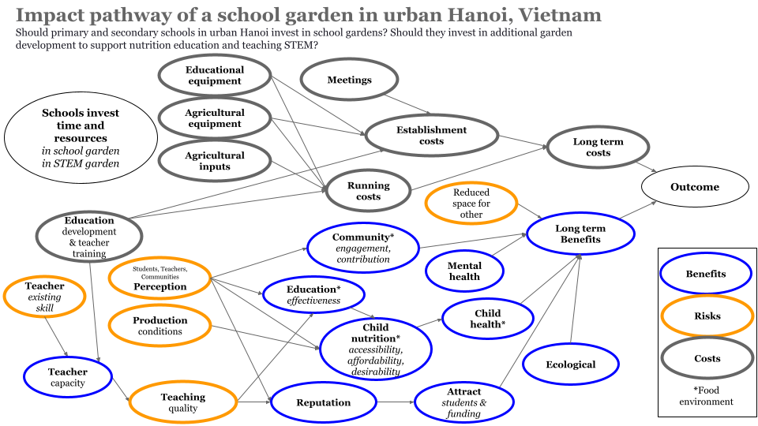

```{r setup, include=FALSE}
knitr::opts_chunk$set(echo = TRUE)

library(gtExtras)
library(svglite)
```

Here we model an intervention to improve food environments and address malnutrition among school-aged children in urban Hanoi. The intervention is formulated as a decision model with three options: introduce a garden at the school, introduce the garden and make it a formal part of the education system, do not introduce a garden. Conceptually the food environment is described in the following figure. The circles with the dotted lines are external or underlying factors. 


We express the general concept of the food environment is slightly differently when we describe it in the context of an intervention. In this figure we show that both the garden products and the education program of a school garden are expected to influence the food environment and how this is expected to happen. The garden itself may have a direct effect if it produces fruits and vegetables that are consumed by students. The garden may also effect the food environments of children by influencing their knowledge about and desire for healthy foods, including fruits and vegetables. The education that students receive may change their perception, make them willing to pay, and also increase their access to fresh fruits and vegetables. Several other expected effects are also included in the figure. 


**Conceptual model of how school gardens in urban Hanoi schools could influence the food environments of children.**

## Garden model

The gardens will be created in existing land that is available on school grounds. In the the STEM (Science Technology Education and Math) alternative, the gardens will be designed for teaching about nutrition and STEM (an approach to learning and development that integrates science, technology, engineering and maths) at primary and secondary schools.

The model was developed across several iterative workshops in July 2023. These included decision definition, conceptual model development of the selected decision and an initial programming session with preliminary model results. The resulting model was further developed through August to November 2023. 



**Conceptual model of school gardens as an intervention. Should urban Hanoi school boards invest time and money in creating school gardens? Should they invest in formal STEM education as part of these gardens?**

**No garden**

Here we model the baseline of not having a garden. There are some advantages to this including additional play area for kids and the possibilility of other uses for the space such as parking when school is not in session. 

**School garden**

This intervention involves establishing a garden with a dual focus on gardening education. The initiative encompasses the financial aspects of compost, livestock, garden design, equipment, and construction costs. Establishment costs are allocated for compost initiation, worm maintenance, introducing small animals, hiring a planner for garden design, and acquiring necessary equipment, including potential smart systems. The focus extends from enriching soil quality to creating an aesthetically pleasing and functionally equipped garden

**School garden designed to contribute to teaching Science Technology Education and Maths (STEM)**

In this option we integrate a focus on sciences and STEM education into the garden. Integrating STEM education through the provision of specialized teaching equipment and training for teachers. Establishment costs include  science-oriented teaching equipment, with a focus on practical tools like microscopes. Teachers need training for gardening and STEM topics spanning 5 to 7 subjects over 12 days. The intervention aims to not only create a sustainable and interactive garden space but also to enhance educational experiences by incorporating science-oriented learning.

**School garden implementation and monitoring**

We want to test our uncertainty here and get as much additional information as we can to better understand the complexity of effects of school gardens on the food environments children. A test run of the intervention, in the form of an actual school garden on school property, will be carried out by the Center for the Development of Organic Agriculture (CODAS) under the Association of Organic Agriculture of Vietnam. In the 2nd year the garden is expected to start running well. The 3rd year is when the STEM education plan will be fully running.

# Urban Hanoi school garden 

Here is our simulation of the school garden intervention options.

```{r mcsimulation, warning=FALSE, message=FALSE}
# Source our model
source("CODAS_Garden_Model.R")

# Ensure consistent results with the random number generator
# not for each 'run' of the MC simulation but for 
# consistency each time we call on the simulation 
set.seed(1234) 

garden_simulation_results <- mcSimulation(
  estimate = estimate_read_csv("inputs_school_garden.csv"),
  model_function = school_garden_function,
  numberOfModelRuns = 1000, #run 1000 times
  functionSyntax = "plainNames"
)

```

Here is a plot of the Net Present Value (i.e. current value of the future benefits) of the garden decision options over `r garden_simulation_results$x$number_of_years[1]` years of the intervention. For public and private schools the STEM costs are considered to be in the same garden space but with the additional costs and benefits of a full STEM education program. All options are compared to the same years of using the land for something that is not related to the garden, i.e. as a playground or for parking. Here we plot the distribution for the decision and frame the projected NPV. 


```{r plot_dist, warning=FALSE, message=FALSE}
source("functions/plot_distributions.R")
plot_distributions(mcSimulation_object = garden_simulation_results, 
                                    vars = c("decision_garden","decision_STEM", "decision_garden_public_school", "decision_garden_STEM_public_school"),
                                    method = 'smooth_simple_overlay', 
                                    base_size = 7, 
                                    x_axis_name = "Comparative NPV outcomes")
```

This may be easier to see as a boxplot: 

```{r plot_boxplot, warning=FALSE, message=FALSE}
source("functions/plot_distributions.R")
plot_distributions(mcSimulation_object = garden_simulation_results, 
                                    vars = c("decision_garden","decision_STEM", "decision_garden_public_school", "decision_garden_STEM_public_school"),
                                    method = "boxplot", 
                                    base_size = 7, 
                                    x_axis_name = "Comparative NPV outcomes")
```

## Summary of results for the decision


## Summary of the savings for the passive education garden option

```{r summary_decision, warning=FALSE, message=FALSE}
summary(garden_simulation_results$y$decision)
```

Summary of the savings for the formal STEM education garden option

```{r summary_decision_stem, warning=FALSE, message=FALSE}
summary(garden_simulation_results$y$decision_STEM)
```

## Summary of costs

```{r summary_costs, warning=FALSE, message=FALSE}
summary(garden_simulation_results$y$total_costs)
```

```{r summary_costs_stem, warning=FALSE}
summary(garden_simulation_results$y$total_costs_STEM)
```

# First year

```{r summary_first_year_costs, warning=FALSE, message=FALSE}
summary(garden_simulation_results$y$Cashflow_garden1)
```

```{r summary_first_year_costs_stem, warning=FALSE, message=FALSE}
summary(garden_simulation_results$y$Cashflow_garden_STEM1)
```


# Expected Value of Perfect Information (EVPI)

Here we assess value of information with the `multi_EVPI` function.

```{r mc_table, warning=FALSE, message=FALSE}
# Subset the outputs from the mcSimulation function (y) by selecting the correct variables be sure to run the multi_EVPI only on the variables that we want. Find them with names(garden_simulation_results$y)
mcSimulation_table <- data.frame(garden_simulation_results$x, 
                                 garden_simulation_results$y[1:9])
```

**Value of information for the garden option (no STEM)**

```{r evpi-general_calc}
source("functions/multi_EVPI.R")
# first_out_var is the first result variable in the table, "NPV_garden" in our case.
# names(garden_simulation_results$y)
evpi <- multi_EVPI(mc = mcSimulation_table, first_out_var = "NPV_garden")
```

**Value of information the garden intervention decision**

```{r plot-evpi-decision_garden}
source("functions/plot_evpi.R")
plot_evpi(evpi, decision_vars = "decision_garden")
```
In this case there were no high value variables. We can be confident in supporting the decision, even with our imperfect current understanding. 

Value of information for the garden option with formal STEM education.

```{r evpi-decision_STEM}
# using the results of the same multi_EVPI
plot_evpi(evpi, decision_vars = "decision_STEM")
```

Value of information for the public school garden option with no formal STEM education.

```{r evpi-decision_garden_public_school}
# using the results of the same multi_EVPI
plot_evpi(evpi, decision_vars = "decision_garden_public_school")
```

Value of information for the public school garden option with formal STEM education.

```{r evpi-decision_garden_STEM_public_school}
# using the results of the same multi_EVPI
plot_evpi(evpi, decision_vars = "decision_garden_STEM_public_school")
```


# Cashflow of the garden option without formal STEM education

This will be the cost for public and private schools over the intervention. 

```{r plot_cashflow, warning=FALSE, message=FALSE}
source("functions/plot_cashflow.R")
plot_cashflow(mcSimulation_object = garden_simulation_results, 
              cashflow_var_name = "Cashflow_garden")

```

Cashflow of the garden option with formal STEM education

```{r plot_cashflow_STEM, warning=FALSE, message=FALSE}
source("functions/plot_cashflow.R")
plot_cashflow(mcSimulation_object = garden_simulation_results, 
              cashflow_var_name = "Cashflow_garden_STEM")
```

# PLS

We use Projection to Latent Structures model to get some sense of the correlation strength and direction for model variables and our outcome variables.

For passive education garden option

```{r pls_and_plot, warning=FALSE, message=FALSE}
source("functions/pls_model.R")
pls_result <- pls_model(object = garden_simulation_results,
                                resultName = names(garden_simulation_results$y)[1], # the "NPV_garden" 
                                ncomp = 1)
# read in the common input table
input_table <- read.csv("inputs_school_garden.csv")
# source the plot function
source("functions/plot_pls.R")
plot_pls(pls_result, input_table = input_table, threshold = 0.9)
```

For school garden with formal STEM education

```{r pls_plot_stem, warning=FALSE, message=FALSE}
pls_result_STEM <- pls_model(object = garden_simulation_results,
                                resultName = names(garden_simulation_results$y)[2], # the "NPV_garden_STEM" 
                                ncomp = 1)

plot_pls(pls_result_STEM, input_table = input_table, threshold = 0.9)
```

# Input data for the simulations 

## Summary

Here we provide a summary of the garden intervention options. We do this with a summary table of the simulation results. We show the percentage of missing values as well as the mean, median and standard deviation (SD) for each output of our model simulations. We use the `gt_plt_summary()` from {gtExtras} and with options from {svglite}. The table shows the variable name, the plot overview as well as the number of missing values, the mean, median and the standard deviation of the distribution. 

```{r gtExtras_summary, warning=FALSE, message=FALSE}
# Subset the outputs from the mcSimulation function (y) to summarize only on the variables that we want.
# names(garden_simulation_results$x)
mcSimulation_summary <- data.frame(garden_simulation_results$x[2:70],
 # names(garden_simulation_results$y)
                                 garden_simulation_results$y[1:9])

gtExtras::gt_plt_summary(mcSimulation_summary) 
# a summary table with missing, mean, median and sd
```

The full repository can be accessed at https://github.com/CWWhitney/nifam_codas_school_garden with the following QR code.

<!-- The git create a qr -->
<!-- library(qrcode) -->
<!-- qrcode_gen('https://github.com/CWWhitney/kon_tum_homegardens') -->

